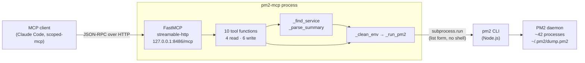
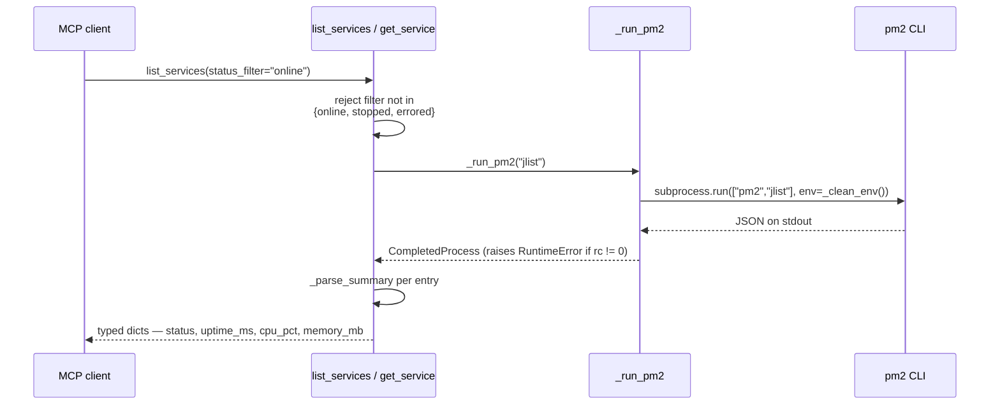
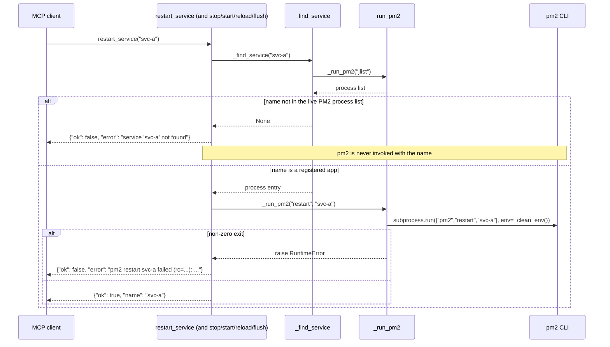
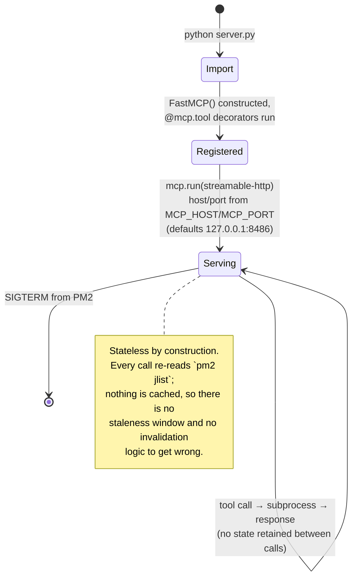
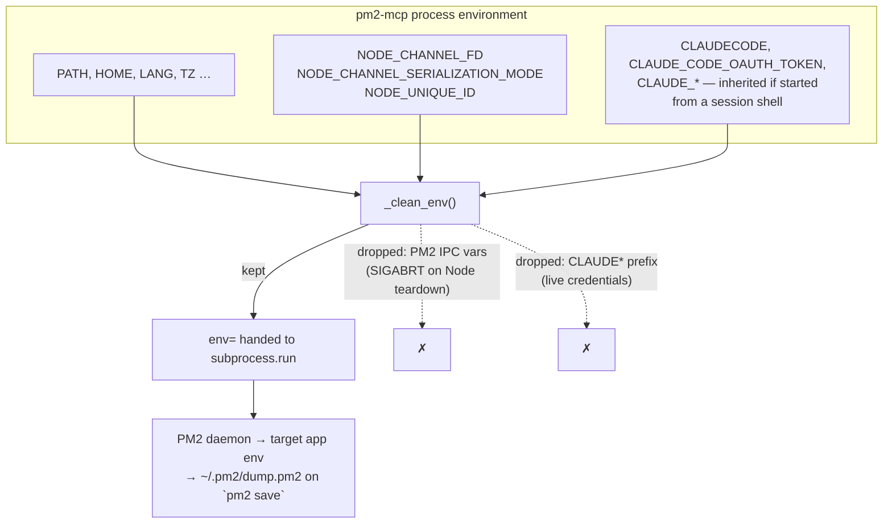

# Architecture

`pm2-mcp` is a single-file FastMCP server that wraps the `pm2` CLI. It is deliberately small:
one module, one subprocess helper, no persistent state, no database, no cache, and one
dependency (`fastmcp`).

The interesting part is not the structure — it is the **environment boundary**, because this
server shells out to a tool that copies its caller's environment into long-lived daemons. That
boundary is the subject of the last diagram, and of `docs/threat-model.md`.

---

## Overview

Every path to PM2 goes through `_run_pm2`, and `_run_pm2` is the only place `subprocess.run`
is called. That is what makes the environment scrub enforceable in one place rather than at
eleven call sites.

---

## Read path

`_parse_summary` is where the raw `pm2 jlist` entry is narrowed to a fixed field set. This is
a deliberate reduction, not laziness: the raw entry contains `pm2_env`, which is the target
app's **entire environment**. Returning it wholesale would turn every read tool into a
credential disclosure. See `docs/threat-model.md`.

---

## Write path

The `_find_service(name) is None` guard is a genuine allowlist, not a sanitiser: the name must
already be a registered PM2 app before it reaches `pm2`. Combined with the list form of
`subprocess.run` — no `shell=True` anywhere — there is no injection surface in the name.

Both `{"ok": false}` outcomes look identical to a caller, which is why the tests for the
second one assert the pm2 verb was *attempted* rather than only checking the returned dict.

---

## Module lifecycle

The server is itself a PM2 service, so it appears in its own `list_services` output — and can
in principle be asked to restart itself. It has no `delete` verb, which is why recovering from
a bad `pm2` registration is an operator task rather than something an agent can do through
this server. See `docs/operations.md`.

---

## Scope and security enforcement — the environment boundary

This diagram is the reason the others are short. `pm2 start` and
`pm2 restart --update-env` hand the **calling process's entire environment** to the PM2 daemon
as the base env for the target app, and `pm2 save` writes it to `~/.pm2/dump.pm2` on disk. An
ecosystem file's `env` block can only *add* keys on top of that — it cannot remove one.

So whatever this process is carrying when it invokes `pm2` can be frozen into an unrelated
long-lived service and persisted to a file. That is not hypothetical: it is vikunja#767, where
a live `CLAUDE_CODE_OAUTH_TOKEN` sat in a world-readable `dump.pm2` for nine days.

Two independent reasons to scrub, with different failure modes:

| Dropped | Why | Failure if it regresses |
|---|---|---|
| `NODE_CHANNEL_FD` and friends | PM2 sets them for its own IPC channel; a Node child inherits a stray fd | `SIGABRT` during teardown — loud, immediate (vikunja#80) |
| `CLAUDE*` | Session credentials inherited when started from an interactive shell | Silent: a credential persisted to disk, discovered nine days later (vikunja#767) |

The second failure mode is why this boundary carries a mutation gate on top of ordinary tests
(`scripts/mutation-gate.sh`). It is also why the shipped `ecosystem.config.js` declares
`env: {}` and says so at length: the app requires nothing from the environment, and stating
that explicitly is what makes "no env block" unambiguous.

**Matching is by prefix, not an enumerated list.** An exact list of known `CLAUDE_*` names has
already gone stale once in this codebase, and every Claude Code release is free to add more
without touching this file.

---

## What is not here

- **No authentication.** Any caller that reaches port 8486 can stop or restart any PM2 process
  on the host. This is a deliberate localhost-only posture, documented rather than fixed —
  see `docs/threat-model.md`.
- **No audit log.** A privileged tool that can stop any of ~42 processes currently emits no
  record when it does. Acknowledged gap, not in scope for the Showcase promotion.
- **No `delete` verb**, and no way to register a new process. `start_service` resumes an
  already-registered app.
- **No caching or persistence.** Deliberate; see the lifecycle note above.
