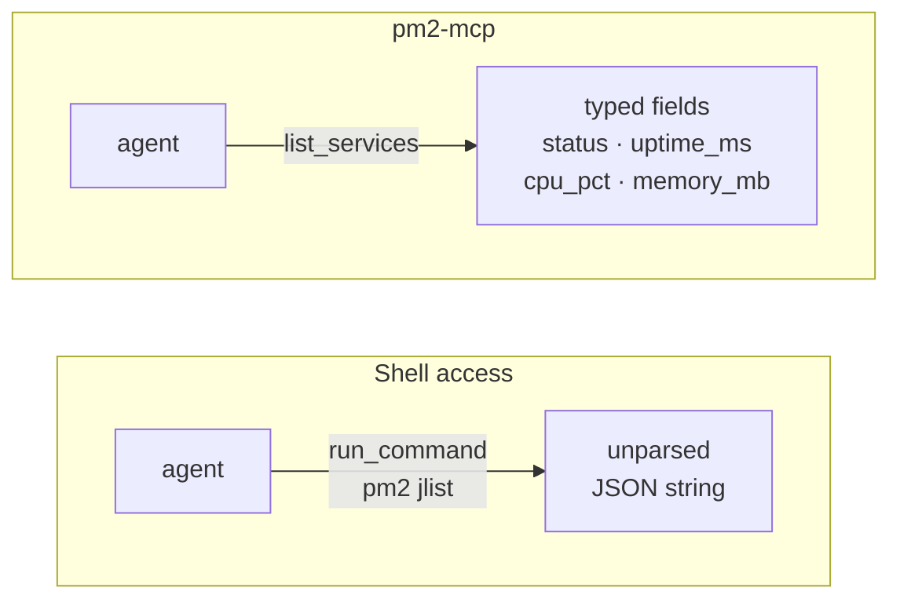

# pm2-mcp

[](https://claude.ai/code)
[](https://github.com/TadMSTR/pm2-mcp/actions/workflows/ci.yml)
[](LICENSE)

An MCP server that gives agents structured read and limited write access to PM2 services. Built with FastMCP, transport is streamable-http bound to localhost.

I built this because every other approach to PM2 inspection from an agent involves either raw shell access (homelab-ops `run_command`) or scraping human-readable `pm2 status` output. This server speaks directly to `pm2 jlist`, returns typed fields, and validates service names before issuing any write operations.



## Tools

### Read

| Tool | Description |
|------|-------------|
| `list_services` | List all PM2 services. Optional `status_filter`: `"online"`, `"stopped"`, or `"errored"`. |
| `get_service` | Full detail for one service by name — script path, cwd, args, log file paths, created_at, plus all summary fields. |
| `get_logs` | Tail recent log output. `lines` defaults to 50 (max 500); `include_errors` defaults to `true`. |
| `get_status` | Server metadata and PM2 health summary — configured host/port, PM2 version, service counts by status. |

### Write

| Tool | Description |
|------|-------------|
| `restart_service` | Restart a service. Validates the name first — returns `{ok: false}` if not found. |
| `stop_service` | Stop a service. Does not remove it from the PM2 process list. |
| `start_service` | Resume a stopped service already registered in PM2. Does not register new processes. |
| `reload_service` | Gracefully reload a service (zero-downtime). Preferred over `restart_service` for production services. |
| `save` | Persist the current PM2 process list to disk. Call after write operations to survive reboots. |
| `flush_logs` | Clear log files for a service. |

### Response shape — `list_services`

```json
[
  {
    "name": "my-service",
    "pm_id": 12,
    "status": "online",
    "pid": 18432,
    "uptime_ms": 3720000,
    "restarts": 0,
    "cpu_pct": 0.2,
    "memory_mb": 48.5,
    "exec_mode": "fork_mode"
  }
]
```

`get_service` extends this with `script`, `cwd`, `args`, `log_file`, `error_file`, and `created_at`.

---

## Non-goals

Things this server deliberately does not do. Each is a decision, not a gap:

- **It does not register new PM2 processes.** `start_service` resumes a process PM2 already
  knows about; it will not create one. Registering a process means deciding its script,
  interpreter, working directory, log paths and environment — that belongs in a reviewed
  `ecosystem.config.js`, not in an agent tool call.
- **There is no `delete` verb, and there will not be one.** `pm2 delete` discards the
  process definition, and re-creating it re-captures the calling shell's environment — the
  exact mechanism behind [#767](https://github.com/TadMSTR/pm2-mcp/issues/767). The
  destructive verb with the worst failure mode is the one least worth automating.
- **It has no authentication, by design.** It binds loopback only and is expected to stay
  that way. Adding auth would imply the port could safely be exposed, which is not the
  posture this server is built for. See [docs/threat-model.md](docs/threat-model.md).
- **It does not publish an installable artefact.** No PyPI package, no version badge. It is
  deployed from a checkout as a PM2 process. This is why Showcase is its terminal tier
  rather than a step toward Flagship.
- **It does not manage the PM2 daemon itself** — no `pm2 kill`, no daemon resurrection, no
  startup-script installation. Those are host administration, not process inspection.

## Setup

### Requirements

- Python 3.11+
- PM2 installed and in PATH for the user running the server
- `fastmcp>=3.2.4` (see `requirements.txt`)

```bash
pip install -r requirements.txt
```

### Run as a PM2 process (recommended)

This repository ships the `ecosystem.config.js` it actually deploys with — use that rather
than the sketch this section used to contain:

```bash
pm2 start ecosystem.config.js --only pm2-mcp
pm2 save
```

Three things in it are host-specific: `script` (the venv interpreter path), `cwd`, and the
log paths. Leave the rest alone — in particular `env: {}`, which is empty deliberately and
carries a comment explaining why. See [examples/](examples/) and
[docs/operations.md](docs/operations.md).

**Start it from PM2 at boot, not from an interactive shell.** `pm2 start` hands the calling
shell's entire environment to the daemon, and `pm2 save` writes it to disk. That is how a
live credential ended up in a world-readable `dump.pm2` for nine days.

Or inline with env vars:

```bash
MCP_HOST=127.0.0.1 MCP_PORT=8486 pm2 start server.py --interpreter python3 --name pm2-mcp
pm2 save
```

The server manages itself like any other PM2 service — it will appear in its own `list_services` output.

### Run directly

```bash
python server.py                                    # 127.0.0.1:8486
python server.py --port 9000                        # override the port only
python server.py --host 127.0.0.2 --port 9000       # both
python server.py --help                             # full usage
```

Non-loopback binds are refused; see [Bind address and port](#bind-address-and-port).

---

## Bind address and port

The bind is resolved from three sources, in this order of precedence:

| Precedence | Source | Example |
|---|---|---|
| 1 (highest) | Command-line flags | `--host 127.0.0.1 --port 8486` |
| 2 | Environment variables | `MCP_HOST`, `MCP_PORT` |
| 3 (lowest) | Built-in defaults | `127.0.0.1`, `8486` |

Precedence is per-field, not all-or-nothing: passing only `--host` leaves the port to
`MCP_PORT` or the default.

| Variable | Default | Description |
|----------|---------|-------------|
| `MCP_HOST` | `127.0.0.1` | Bind address. Must be loopback. |
| `MCP_PORT` | `8486` | Port for the MCP server |

Copy `.env.example` to `.env` and fill in the values you need. Blank environment variables
are treated as unset and use the defaults shown above.

### The bind is loopback-only, and that is enforced

`--host` and `MCP_HOST` accept `127.0.0.0/8`, `::1` and `localhost`. **Anything else exits
non-zero instead of starting** — including `0.0.0.0`, a LAN address, and any hostname.

This is deliberate and there is **no override flag**. pm2-mcp has no authentication of any
kind, and its write verbs can stop or restart any PM2 process on the host. A `--host` that
accepted `0.0.0.0` would turn a documented-safe posture into a one-word footgun, so the
refusal is in code rather than in a comment. See [docs/threat-model.md](docs/threat-model.md).

A hostname is refused rather than resolved: a name can point anywhere, and can be repointed
after the check passes without the process restarting, so resolution is not a security
boundary.

> **Note:** these flags were accepted but silently ignored before v0.4.0 — `server.py` had no
> argument parsing and read only `MCP_HOST`/`MCP_PORT`. They are live as of
> [#770](https://github.com/TadMSTR/pm2-mcp/issues/770).

---

## Wiring to Claude Code

Add to `~/.claude/settings.json` under `mcpServers`:

```json
{
  "mcpServers": {
    "pm2": {
      "type": "streamable-http",
      "url": "http://127.0.0.1:8486/mcp"
    }
  }
}
```

---

## Security

The server binds to `127.0.0.1` by default. Any client that can reach port 8486 can restart or stop services — there is no authentication. This is intentional for local agent use: keep it localhost-only and don't proxy it externally.

The write tools (`restart_service`, `stop_service`, `start_service`, `reload_service`, `flush_logs`) validate service names against the live PM2 process list before acting. An unrecognized name returns `{ok: false, error: "service '...' not found"}` without touching PM2.

Before invoking the `pm2` CLI the server scrubs its own environment — PM2's IPC variables, and anything matching the `CLAUDE` prefix. `pm2 start` and `pm2 restart --update-env` copy the caller's whole environment into the target app and `pm2 save` persists it, so this is the difference between a credential staying in memory and being written to disk.

Full posture, including the gaps that are accepted rather than fixed: **[docs/threat-model.md](docs/threat-model.md)**.

---

## Testing

```bash
pip install -r requirements.txt -r requirements-dev.txt
pytest -v
```

All tests mock `_run_pm2` — no PM2 installation required.

Coverage and its floor are configured in `pyproject.toml`, so a bare `pytest` enforces them; there is no separate CI-only flag. Changes to `_clean_env` or `_run_pm2` should also pass the mutation gate:

```bash
MUTMUT=.venv/bin/mutmut ./scripts/mutation-gate.sh
```

See [CONTRIBUTING.md](CONTRIBUTING.md) for what that gate does and, more importantly, what it does not cover.

---

## Documentation

| | |
|---|---|
| [ARCHITECTURE.md](ARCHITECTURE.md) | Request flow, module lifecycle, and the environment boundary |
| [docs/operations.md](docs/operations.md) | Deploying, health checks, recovery |
| [docs/threat-model.md](docs/threat-model.md) | What's protected, what isn't, and why |
| [examples/](examples/) | Real client config and a worked crash-loop diagnosis |
| [CONTRIBUTING.md](CONTRIBUTING.md) | Dev setup, test loop, mutation gate |
| [SECURITY.md](SECURITY.md) | Reporting a vulnerability |

---

## License

MIT — see [LICENSE](LICENSE).
