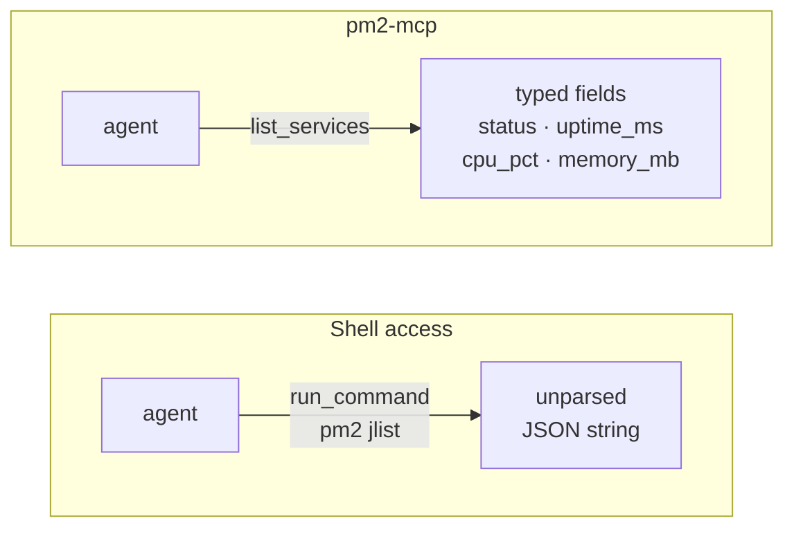

# pm2-mcp

[](https://claude.ai/code)
[](https://github.com/TadMSTR/pm2-mcp/actions/workflows/ci.yml)

An MCP server that gives agents structured read and limited write access to PM2 services. Built with FastMCP, transport is streamable-http bound to localhost.

I built this because every other approach to PM2 inspection from an agent involves either raw shell access (homelab-ops `run_command`) or scraping human-readable `pm2 status` output. This server speaks directly to `pm2 jlist`, returns typed fields, and validates service names before issuing any write operations.



## Tools

### Read

| Tool | Description |
|------|-------------|
| `list_services` | List all PM2 services. Optional `status_filter`: `"online"`, `"stopped"`, or `"errored"`. |
| `get_service` | Full detail for one service by name — script path, cwd, args, log file paths, created_at, plus all summary fields. |
| `get_logs` | Tail recent log output. `lines` defaults to 50 (max 500); `include_errors` defaults to `true`. |
| `get_status` | Server metadata and PM2 health summary — configured host/port, PM2 version, service counts by status. |

### Write

| Tool | Description |
|------|-------------|
| `restart_service` | Restart a service. Validates the name first — returns `{ok: false}` if not found. |
| `stop_service` | Stop a service. Does not remove it from the PM2 process list. |
| `start_service` | Resume a stopped service already registered in PM2. Does not register new processes. |
| `reload_service` | Gracefully reload a service (zero-downtime). Preferred over `restart_service` for production services. |
| `save` | Persist the current PM2 process list to disk. Call after write operations to survive reboots. |
| `flush_logs` | Clear log files for a service. |

### Response shape — `list_services`

```json
[
  {
    "name": "my-service",
    "pm_id": 12,
    "status": "online",
    "pid": 18432,
    "uptime_ms": 3720000,
    "restarts": 0,
    "cpu_pct": 0.2,
    "memory_mb": 48.5,
    "exec_mode": "fork_mode"
  }
]
```

`get_service` extends this with `script`, `cwd`, `args`, `log_file`, `error_file`, and `created_at`.

---

## Setup

### Requirements

- Python 3.11+
- PM2 installed and in PATH for the user running the server
- `fastmcp>=3.2.4` (see `requirements.txt`)

```bash
pip install -r requirements.txt
```

### Run as a PM2 process (recommended)

Using `ecosystem.config.js` (recommended — add to your existing config):

```js
{
  name: 'pm2-mcp',
  script: 'server.py',
  interpreter: 'python3',
  env: {
    PYTHONUNBUFFERED: '1',
    MCP_HOST: '127.0.0.1',
    MCP_PORT: '8486',
  }
}
```

```bash
pm2 start ecosystem.config.js --only pm2-mcp
pm2 save
```

Or inline with env vars:

```bash
MCP_HOST=127.0.0.1 MCP_PORT=8486 pm2 start server.py --interpreter python3 --name pm2-mcp
pm2 save
```

The server manages itself like any other PM2 service — it will appear in its own `list_services` output.

### Run directly

```bash
python server.py
```

---

## Environment Variables

| Variable | Default | Description |
|----------|---------|-------------|
| `MCP_HOST` | `127.0.0.1` | Bind address for the MCP server |
| `MCP_PORT` | `8486` | Port for the MCP server |

Copy `.env.example` to `.env` and fill in the values you need. Blank values use the defaults shown above.

---

## Wiring to Claude Code

Add to `~/.claude/settings.json` under `mcpServers`:

```json
{
  "mcpServers": {
    "pm2": {
      "type": "streamable-http",
      "url": "http://127.0.0.1:8486/mcp"
    }
  }
}
```

---

## Security

The server binds to `127.0.0.1` by default. Any client that can reach port 8486 can restart or stop services — there is no authentication. This is intentional for local agent use: keep it localhost-only and don't proxy it externally.

The write tools (`restart_service`, `stop_service`, `start_service`, `reload_service`, `flush_logs`) validate service names against the live PM2 process list before acting. An unrecognized name returns `{ok: false, error: "service '...' not found"}` without touching PM2.

---

## Testing

```bash
pip install -r requirements.txt -r requirements-dev.txt
pytest -v
```

All tests mock `_run_pm2` — no PM2 installation required.

---

## License

MIT
